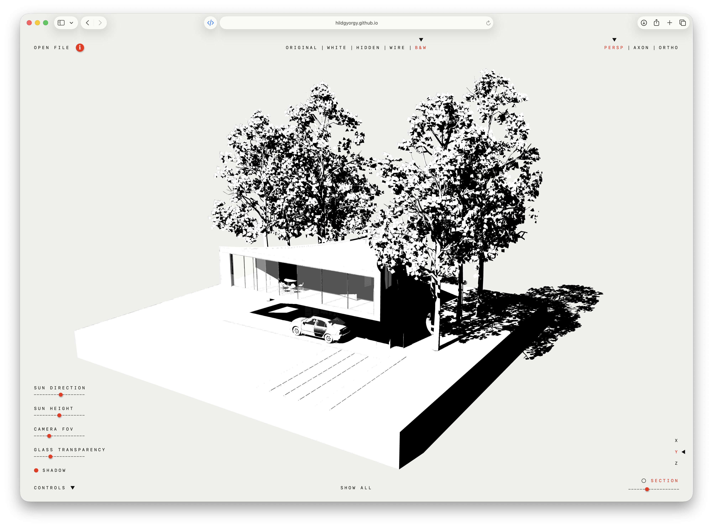

# Drop & View



A lightweight browser-based 3D model viewer by **György Hild**. Open a model, explore it, and share the file with a client who can view it without installing a desktop application or creating an account.

**[Open the viewer](https://hildgyorgy.github.io/drop-3d-view/)** · **[Usage guide and support](https://hildgyorgy.github.io/app-support/drop-view/)**

## Getting started

1. Drop a **GLB**, **FBX** or **GLTF** file onto the page, or choose **OPEN FILE**. You can also try the **DEMO** on the start screen.
2. Drag with the left mouse button to orbit, drag with the right button to pan, and scroll or pinch to zoom.
3. Double-click a point on the model to bring it to the centre of the view.
4. Lost your model while zooming or panning? Choose **ZOOM ALL** at the bottom centre to fit the whole model back into view while keeping the viewing direction, projection and group visibility.

Use a modern browser with JavaScript and WebGL support. Large models may require more memory and a more capable device.

## Views and controls

- **Display styles:** ORIGINAL, WHITE, HIDDEN, WIRE and B&W.
- **PERSP:** perspective viewing with an adjustable field of view.
- **AXON:** an orbitable axonometric view with parallel projection.
- **ORTHO:** TOP, FRONT, LEFT, RIGHT and BACK presets. Elevations can be rotated horizontally while remaining upright and orthogonal. TOP stays fixed. Double-click centring preserves the current ORTHO direction.
- **CONTROLS:** sun direction, sun height, glass transparency and shadows. Camera FOV is available in PERSP; sun and shadow controls are disabled in WIRE.
- **PATH TRACER:** optional progressive path-traced rendering under ORIGINAL mode. Legacy alpha-blended glass is upgraded to thin physical glass when it can be distinguished safely from masked or texture-backed transparency. SUN DIRECTION is shared by ORIGINAL and PATH TRACER. For GLBs with an exported sun position, both direction and height are shared, and the HDRI lighting aligns with that sun. Without exported sun data, the HDRI retains its native sun height, so SUN HEIGHT adjusts only the regular ORIGINAL sun. The SAMPLES status shows the number of samples per pixel. Move the camera to compose the image, then pause while the image refines. Requires WebGL 2 and an internet connection the first time the renderer is loaded.
- **SECTION:** toggle cutting with the circle, choose an X/Y/Z axis and move the section slider to inspect the interior.

The three corner menus start closed. Click their labels to open or close them; click the model area or press Escape to close them. The red **i** beside OPEN FILE opens an About panel with the Support link and, when included in the GLB, the model's design credits.

### Adaptive menu contrast

When a model is open, the non-red overlay labels use CSS `mix-blend-mode: difference`: they appear dark over light pixels and light over dark pixels without putting panels over the model. Safari sometimes leaves those labels white over the WebGL canvas, so it samples the rendered canvas beneath each label about twice per second and switches that label between crisp dark and white text. This avoids panels and text halos; Safari's switch is per label, not per letter. Red active and hover states, the About button, sliders and coloured controls keep their normal colours. This is a visual aid, not a guaranteed contrast or accessibility threshold; labels can still be faint over mixed or mid-tone areas.

The feature is isolated in [`css/adaptive-contrast.css`](css/adaptive-contrast.css) and [`js/ui/adaptive-contrast.js`](js/ui/adaptive-contrast.js). To switch it off, remove the stylesheet link from `index.html` and the `updateAdaptiveContrast` import/call from `js/main.js`; the viewer then uses its original styling. For a complete code cleanup, also remove the Safari-detection script and the inert `adaptive-text` spans/classes from the slider and toggle labels in `index.html`. These wrappers let only the words blend while the red slider thumbs and toggle indicators remain untouched. The CSS also replaces some `fixed` and transformed positioning with visually equivalent `absolute` positioning while a model is open, because those stacking contexts otherwise prevent the labels from blending with the WebGL canvas—especially in windows at or below 1100 px wide.

If a file cannot be opened, the start screen returns with a red error message in place of the privacy note. Try another file or the demo.

## Model formats

**GLB is recommended.** In our testing it gives the most consistent materials, textures and overall visual result. A self-contained GLB can carry both geometry and textures in one file. Archicad workflows include a paid direct-export plugin, conversion through Blender or an online converter, or Datasmith export followed by GLB export from Unreal Engine.

GLB files exported with a saved Drop & View initial view open from that viewing direction and projection, automatically zoomed to show the whole model. Files without one still open in the automatically fitted view.

**FBX is a useful quick option**, particularly with native export from supported Archicad versions. Results can vary between versions and export settings: orientation, colours and textures may differ, materials can appear darker, and some files may fail to load. Converting through Blender to GLB can help, but cannot restore textures missing from the original export.

**GLTF is also supported**, but files referencing separate local textures or binary data may not load correctly: the viewer opens one selected file at a time. Prefer an embedded GLB for sharing.

See the [support guide](https://hildgyorgy.github.io/app-support/drop-view/) for export workflows and limitations.

## Privacy and sharing

Your selected model is processed locally in your browser. Drop & View does not upload it to a developer-operated server and requires no account or login.

To share a project, send the model file and the viewer's web address. There is no model-hosting service or uploaded-model sharing link.

The app loads Three.js and, when required, Draco decoder files from jsDelivr. PATH TRACER loads its rendering modules from the same CDN only when the mode is first selected. The demo downloads from the app's website. External online converters are separate services with their own upload processes and privacy terms.

## Free to use; proprietary code

The published Drop & View web app is **free to use for personal and commercial projects**, including client work. You retain your rights in your models and may share images of your own work produced with the viewer, subject to any third-party rights in that content.

This is not an open-source licence. Except where applicable law or separate permissions allow it, reusing the application's proprietary code in another product, distributing modified versions, or hosting copies requires prior written permission. Public access to this repository does not grant those rights. GitHub's platform permissions and third-party component licences remain applicable.

See [LICENSE](LICENSE) for the full terms. For permission requests, contact [hild.gyorgy@freemail.hu](mailto:hild.gyorgy@freemail.hu).

## Possible next steps

- Real-world sun and shadow studies using the project's geographic location, orientation, date and time.
- Proper image export directly from the viewer instead of relying on screenshots.
- Optional model-element visibility controls. Whether these should follow layers, materials/textures or Archicad element types still needs investigation.

## Local preview

For the author, authorised contributors, or anyone with separate permission to run a local copy, the project is a static HTML/CSS/JavaScript application with no build step:

```sh
python3 -m http.server 8000
```

Open `http://localhost:8000`. ES modules require an HTTP server; opening `index.html` directly with a `file://` URL is not sufficient. Network access is needed for CDN dependencies unless they are already cached.

The section geometry has dependency-free automated tests. With Node.js installed, run:

```sh
npm test
```

## Project layout

- `index.html` — viewer interface and Three.js import map
- `css/` — layout and visual styling
- `js/core/` — scene, cameras, controls and application state
- `js/model/` — model loading and materials
- `js/view/` — display modes, navigation, framing, lighting and edges
- `js/section/` — clipping, intersection collection, planar contours, fill triangulation and section rendering
- `js/ui/` — menus, messages and model inspection helpers
- `assets/hdri/` — bundled environment lighting used by PATH TRACER
- `demo/` — sample model used by the viewer
- `test/` — automated tests for the section geometry's pure algorithms

## Third-party components

Drop & View uses [Three.js](https://threejs.org/) and [three-gpu-pathtracer](https://github.com/gkjohnson/three-gpu-pathtracer) under their MIT licences, [three-mesh-bvh](https://github.com/gkjohnson/three-mesh-bvh) under its MIT licence, and [Draco](https://github.com/google/draco) under its [Apache 2.0 licence](https://github.com/google/draco/blob/main/LICENSE). PATH TRACER uses the replaceable `assets/hdri/backdrop.hdr` environment image from [Poly Haven](https://polyhaven.com/hdris/pure-skies) under its [CC0 licence](https://polyhaven.com/license). These components and assets retain their own licences; the proprietary terms apply only to the project's own material.

## Contact

Questions, feedback and permission requests: **[hild.gyorgy@freemail.hu](mailto:hild.gyorgy@freemail.hu)**

Copyright © 2026 György Hild.
